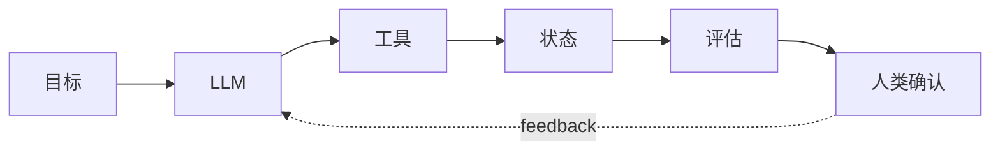

# 前言：为什么需要 AI Agent 开发圣经

## Story Explanation

想象一家公司的运营同学每天要打开十几个系统：查销售数据、读客户反馈、生成日报、同步团队进展。传统脚本能处理固定流程，但一旦问题变成“帮我判断今天异常在哪里，并给出下一步动作”，脚本就开始吃力。AI Agent 的价值，就是把语言理解、工具调用、状态管理和反馈循环组合成一个能协助完成复杂任务的工程系统。

## Technical Explanation

AI Agent 不是一个单独模型，而是围绕目标构建的系统：LLM 负责理解和生成，工具负责访问外部世界，记忆负责保存状态，编排层负责控制步骤，评估层负责判断质量。一本 Agent 教材必须同时讲清模型能力和工程边界，否则读者只能做演示，难以做生产系统。

## Mermaid Diagram



## Python Code

```python
from dataclasses import dataclass

@dataclass
class Milestone:
    name: str
    outcome: str

path = [
    Milestone("LLM Basics", "understand tokens and context"),
    Milestone("RAG", "ground answers in documents"),
    Milestone("Agent", "combine tools, memory, and control"),
]

for step, milestone in enumerate(path, 1):
    print(f"{step}. {milestone.name}: {milestone.outcome}")
```

See also: [example.py](example.py)

## Engineering Use Case

为团队搭建一个“AI 工作流助理”，它能读取任务描述、选择模板、调用数据查询工具、生成阶段性报告，并在高风险步骤前请求人工确认。

## Interview Questions

- 为什么说 Agent 是系统而不是模型？
- 一个 Agent 项目最早应该设计哪些边界？
- 如何判断一个 AI demo 是否能进入生产环境？

## Quality Checklist

- 解释是否能被没有框架经验的开发者理解。
- 技术概念是否能落到输入、输出、状态、工具和评估。
- Mermaid 图是否表达了系统流向。
- Python 示例是否可独立运行。
- 工程案例是否说明真实业务价值。

## Navigation

- [Previous](../README.md)
- [Next](../01-AI-Basics/index.md)
