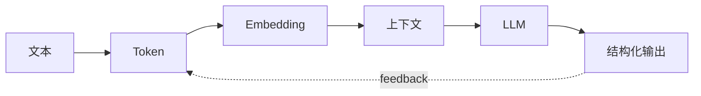

# AI 到底是什么：从概率预测到工程边界

## Story Explanation

一个新同学第一次接触大模型时，往往会惊讶于它能写文章、改代码、总结文档。但几天后他会发现：模型有时自信地答错，有时忘记上下文，有时输出格式不稳定。这不是简单的“模型不够聪明”，而是概率生成系统进入工程场景后暴露出的边界。

最重要的第一句话是：AI 不是像人一样思考，而是在大量数据中学习模式，然后对下一个最可能出现的结果做预测。ChatGPT 看起来像在理解你，其实它更像一个极其强大的概率模型：根据你的输入、上下文和训练中学到的规律，生成最可能有用的回答。

这并不会降低 AI 的价值。恰恰相反，理解“AI = 概率预测系统”之后，开发者会更清楚该如何使用它：让它做语言理解、归纳、生成、分类和辅助决策，同时用工程系统约束它的输出、验证它的事实、记录它的行为。

## Technical Explanation

AI 可以从大到小理解为一条技术链路：

- AI：让机器表现出某种智能行为。
- ML：让机器从数据中学习规律。
- DL：用深度神经网络学习复杂模式。
- Transformer：用注意力机制处理序列和上下文。
- LLM：基于 Transformer 的大规模语言模型。

AI 应用开发需要理解 token、embedding、上下文窗口、推理参数和幻觉。Token 是模型处理文本的基本单位，embedding 把文本映射为向量，上下文窗口决定模型当前可见信息，推理参数控制生成的随机性和长度。工程系统必须把这些概念转化为输入控制、输出校验和质量评估。

传统程序通常遵循明确规则：输入 A，就执行 B。AI 系统则更像概率判断：输入 A，在上下文 C 下，生成最可能的 B、C 或 D。因此，AI 工程不是把模型当成确定性函数，而是把模型放进一个可验证、可回滚、可观测的系统中。

## Core Summary

- AI 不是“真正理解”，而是基于数据模式进行预测。
- ChatGPT 本质上是概率生成模型。
- AI 与传统程序的核心区别是：传统程序执行规则，AI 根据模式生成结果。
- AI 的工程价值来自“模型能力 + 系统约束”的组合。

## Mermaid Diagram



## Python Code

```python
def estimate_tokens(text: str) -> int:
    # Rough English/Chinese mixed estimate for planning, not billing.
    return max(1, len(text) // 3)

def can_fit(system_prompt: str, user_input: str, limit: int = 8000) -> bool:
    return estimate_tokens(system_prompt) + estimate_tokens(user_input) < limit

print(can_fit("You are a careful assistant.", "summarize this document" * 200))
```

See also: [example.py](example.py)

## Engineering Use Case

构建一个支持文档总结的内部助手：先估算 token 成本，再压缩上下文，最后要求模型按固定 JSON schema 返回摘要、风险和行动项。

## Interview Questions

- Token 和字符有什么区别？
- Embedding 在 RAG 中起什么作用？
- 为什么降低 temperature 不等于消除幻觉？
- 为什么说 AI 不是思考，而是预测？
- AI、ML、DL、Transformer、LLM 之间是什么关系？

## Quality Checklist

- 解释是否能被没有框架经验的开发者理解。
- 技术概念是否能落到输入、输出、状态、工具和评估。
- Mermaid 图是否表达了系统流向。
- Python 示例是否可独立运行。
- 工程案例是否说明真实业务价值。

## Navigation

- [Previous](../00-Preface/index.md)
- [Next](../02-Transformer/index.md)
