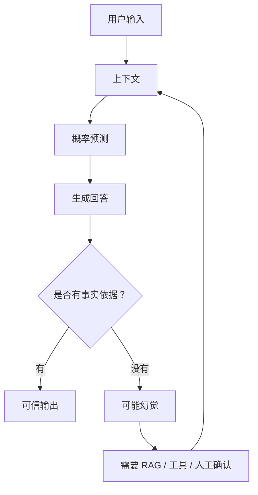

# 🤖 第1章：AI到底是什么？

---

## 🎯 本章目标（非常重要）

学完这一章，你必须能够回答：

- AI到底是不是“思考”？
- ChatGPT到底在做什么？
- AI和人类思维的区别
- 为什么AI会“胡说”
- 什么是“概率模型”

---

## 🧠 1. 一个真实世界的故事（理解AI本质）

想象你有一个超级实习生。

他有一个特点：

> 他看过全世界几乎所有的书、文章、代码和对话。

但他有一个致命限制：

> 他从来没有真正“理解”任何东西。

这个超级实习生很厉害。你问他产品方案，他能写；你问他 Python 代码，他能写；你让他总结一篇论文，他也能总结。

但你必须记住：他并不是像人一样理解世界，而是在过去看过的大量文本中寻找模式，然后生成一个“最像正确答案”的回答。

---

## 📌 举个例子

你问他：

> 今天天气怎么样？

他的思考过程不是：

- ❌ 去查天气
- ❌ 看实时数据
- ❌ 理解天气系统

而是：

- 👉 在他看过的所有文本中，找最相似的问题
- 👉 找最常见的答案模式
- 👉 拼接一个“最可能的回答”

如果你没有给他实时天气工具，他并不知道今天真正的天气。他只是根据语言模式推测一个看起来合理的回答。

这就是很多 AI 错误的根源：它生成的是“概率上像答案的文本”，不一定是“现实中真实发生的事实”。

---

## 🧠 2. 所以AI的本质是什么？

一句话：

> AI = 基于历史数据的概率预测系统

更准确地说，现代大语言模型会根据当前输入、上下文和训练中学到的模式，预测下一个最可能出现的 token。

当它连续预测很多 token 时，我们就看到了完整的回答。

所以 ChatGPT 看起来像是在说话、解释、推理、写代码，但从底层看，它仍然是在做一件事：

> 根据上下文，不断预测下一个最可能的内容。

---

## ❌ 3. AI不是你以为的“智能”

很多人误解 AI：

- ❌ AI会思考
- ❌ AI有意识
- ❌ AI理解世界

这些都不对。

AI 不会像人一样拥有真实体验。它不知道“热”是什么感觉，也不知道“下雨”是什么触感。它能描述这些东西，是因为它在大量文本中见过人类如何描述这些东西。

---

## ✔ AI真实能力是：

- 模式匹配
- 概率计算
- 语言生成

这三个能力非常强大，但它们不是人类意识。

你可以把 AI 理解成一个“超级模式预测器”。它能从海量数据中学习规律，并在新输入出现时生成最可能有用的输出。

---

## 🧬 4. AI的完整结构（必须记住）

```text
AI（人工智能）
├── 机器学习（Machine Learning）
│   ├── 监督学习
│   ├── 无监督学习
│   └── 强化学习
│
└── 深度学习（Deep Learning）
    └── 神经网络（Neural Network）
        └── Transformer
            └── LLM（ChatGPT）
```

这张结构图非常重要。

AI 是一个大概念，机器学习是实现 AI 的一种重要方法。深度学习是机器学习中的一个分支，神经网络是深度学习的核心工具。Transformer 是现代大语言模型最关键的架构，而 LLM 是基于 Transformer 训练出来的大规模语言模型。

换句话说：

> ChatGPT 不是“整个 AI”，它只是 AI 技术树上的一个重要分支。

---

## 🔍 5. AI 和传统程序有什么区别？

传统程序更像规则机器：

```text
如果 A 发生，就执行 B
```

比如：

```python
if temperature > 30:
    print("天气很热")
```

只要条件一样，程序结果就一样。

AI 不一样。AI 更像概率判断：

```text
看到输入 A，在上下文 C 下，生成最可能的结果 B
```

所以 AI 的输出可能会随着上下文、参数、模型版本和提示词变化。

这就是为什么 AI 工程不能只依赖“模型看起来很聪明”。真正的 AI 工程必须增加：

- 输入控制
- 上下文管理
- 工具调用
- 输出校验
- 事实验证
- 日志记录
- 人工确认

---

## ⚠️ 6. 为什么AI会“胡说”？

AI 胡说，通常不是因为它故意骗人。

更准确地说：

> 当模型缺少事实依据时，它仍然会尝试生成一个语言上合理的答案。

这就是幻觉（hallucination）。

比如你问：

> 某个不存在的论文作者是谁？

模型可能会生成一个看起来很像真实作者的名字。因为在它学到的文本模式里，“论文标题 + 作者名字”是一种常见结构。

但这个答案可能完全不存在。

所以，AI 的幻觉来自两个原因：

- 它的目标是生成合理文本，而不是真正查询事实。
- 如果没有外部工具或资料，它无法确认答案是否真实。

---

## 🧩 7. 工程上应该怎么使用AI？

正确使用 AI 的方式不是问：

> 这个模型是不是足够聪明？

而是问：

> 我如何把模型放进一个可靠的系统里？

一个可靠的 AI 系统通常需要：

- 用 Prompt 明确任务和边界
- 用 RAG 提供可信资料
- 用工具查询实时数据
- 用结构化输出减少不稳定性
- 用评估集测试质量
- 用日志追踪每一步行为
- 在高风险动作前加入人工确认

这也是本书后续章节要解决的问题。

---

## Mermaid Diagram



---

## Python Code

下面这个例子不是在实现真正的 AI，而是用一个极简方式模拟“概率预测”的感觉。

```python
from collections import Counter

history = [
    "AI is prediction",
    "AI is pattern matching",
    "AI is prediction",
    "LLM predicts the next token",
    "AI is probability",
]

words = []
for sentence in history:
    words.extend(sentence.lower().split())

counter = Counter(words)

print("Most common patterns:")
for word, count in counter.most_common(5):
    print(word, count)
```

See also: [example.py](example.py)

---

## Engineering Use Case

假设你要做一个企业内部 AI 助手，用户问：

> 我们公司的报销政策是什么？

错误做法是直接把问题丢给模型，让模型自由回答。

正确做法是：

1. 先检索公司最新报销制度。
2. 把检索到的制度片段放进上下文。
3. 要求模型只能基于资料回答。
4. 如果资料不足，必须回答“无法确认”。
5. 输出答案时附上来源。

这就是从“让 AI 自由发挥”到“把 AI 放进工程系统”的关键变化。

---

## Interview Questions

- AI 到底是不是在思考？为什么？
- ChatGPT 底层到底在做什么？
- AI 和传统程序最大的区别是什么？
- 为什么 AI 会产生幻觉？
- 什么是概率模型？
- AI、机器学习、深度学习、Transformer、LLM 之间是什么关系？
- 如果你要降低 AI 胡说的概率，工程上可以做什么？

---

## Quality Checklist

- 能否用“超级实习生”的故事解释 AI 本质。
- 能否说清 AI 不是意识，而是概率预测。
- 能否画出 AI、ML、DL、Transformer、LLM 的层级关系。
- 能否解释 AI 幻觉为什么发生。
- 能否把 AI 能力放进工程约束中使用。

---

## Navigation

- [Previous](../00-Preface/index.md)
- [Next](../02-Transformer/index.md)
