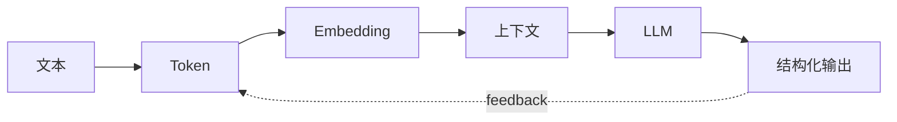

# AI 基础：从模型能力到工程边界

## Story Explanation

一个新同学第一次接触大模型时，往往会惊讶于它能写文章、改代码、总结文档。但几天后他会发现：模型有时自信地答错，有时忘记上下文，有时输出格式不稳定。这不是简单的“模型不够聪明”，而是概率生成系统进入工程场景后暴露出的边界。

## Technical Explanation

AI 应用开发需要理解 token、embedding、上下文窗口、推理参数和幻觉。Token 是模型处理文本的基本单位，embedding 把文本映射为向量，上下文窗口决定模型当前可见信息，推理参数控制生成的随机性和长度。工程系统必须把这些概念转化为输入控制、输出校验和质量评估。

## Mermaid Diagram



## Python Code

```python
def estimate_tokens(text: str) -> int:
    # Rough English/Chinese mixed estimate for planning, not billing.
    return max(1, len(text) // 3)

def can_fit(system_prompt: str, user_input: str, limit: int = 8000) -> bool:
    return estimate_tokens(system_prompt) + estimate_tokens(user_input) < limit

print(can_fit("You are a careful assistant.", "summarize this document" * 200))
```

See also: [example.py](example.py)

## Engineering Use Case

构建一个支持文档总结的内部助手：先估算 token 成本，再压缩上下文，最后要求模型按固定 JSON schema 返回摘要、风险和行动项。

## Interview Questions

- Token 和字符有什么区别？
- Embedding 在 RAG 中起什么作用？
- 为什么降低 temperature 不等于消除幻觉？

## Quality Checklist

- 解释是否能被没有框架经验的开发者理解。
- 技术概念是否能落到输入、输出、状态、工具和评估。
- Mermaid 图是否表达了系统流向。
- Python 示例是否可独立运行。
- 工程案例是否说明真实业务价值。

## Navigation

- [Previous](../00-Preface/index.md)
- [Next](../02-Transformer/index.md)
