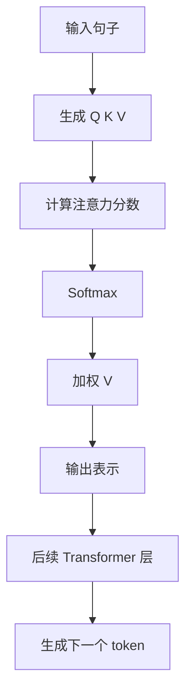

# 📘 第2章：Transformer是什么（完整版教材）

---

## 🎯 本章目标

学完本章，你将彻底理解：

- Transformer 解决了什么问题
- Attention 的本质
- QKV 机制
- 为什么 RNN 被淘汰
- ChatGPT 为什么能理解上下文

---

## 🧠 1. 为什么需要Transformer？

在 Transformer 出现之前，主流序列模型是 RNN。

RNN 的思路很直观：一句话从左到右，一个词一个词读。

但 RNN 有两个致命问题：

> ❌ 不能并行计算  
> ❌ 长文本容易“遗忘”

这两个问题，直接限制了模型处理长文本、长对话和复杂代码的能力。

---

## 📌 举例理解

看这个句子：

> 我把苹果放在桌子上，因为它很重。

人类读到“它”的时候，知道“它”大概率指的是“苹果”。

但 RNN 要一步一步读：

- 读“我”
- 读“把”
- 读“苹果”
- 读“放在”
- 读“桌子上”
- 读“因为”
- 读“它”

问题是：

> 👉 到“它”时，模型可能已经忘了前面的“苹果”。

这就叫长距离依赖问题。

---

## 🚀 2. Transformer的核心思想

一句话：

> Transformer = 让模型“同时看到整个句子”

它不再像 RNN 那样只能一步一步读，而是让句子中的每个词都可以直接和其他词建立关系。

比如在这句话里：

```text
我把苹果放在桌子上，因为它很重。
```

Transformer 可以直接判断：

- “它”和“苹果”关系更强
- “它”和“桌子”关系较弱
- “重”和“苹果”关系更强

这就是 Transformer 强大的根本原因。

---

## 🧠 3. Attention机制是什么？

Attention = 注意力机制。

本质：

> 找到最重要的信息。

模型并不是平均看待每个词，而是会给不同词分配不同权重。

重要的信息权重大，不重要的信息权重小。

---

## 📌 类比（非常重要）

你在读一句话时，会自动判断：

- 哪些词重要
- 哪些词不重要
- 当前词应该参考前面哪些词

例如：

```text
苹果很重，所以它掉了下来。
```

在理解“它”时，“苹果”和“重”比“所以”“了”更重要。

Attention 做的就是这件事：

> 计算当前信息应该关注哪些历史信息。

---

## 🧠 4. QKV机制（核心）

Attention 的核心是 Q、K、V。

每个词都会生成三个向量：

| 角色 | 含义 |
|------|------|
| Q | 我想找什么 |
| K | 我有什么标签 |
| V | 我提供的信息 |

Q、K、V 是理解 Transformer 的关键。

---

## 📌 类比（图书馆）

你去图书馆找书。

- Q = 你想找什么书
- K = 每本书的标签
- V = 书的内容

流程是：

1. 你拿着 Q 去匹配每本书的 K。
2. 匹配度越高，说明这本书越相关。
3. 最后根据相关程度，读取对应的 V。

这就是 Attention。

---

## ⚙️ 5. Attention计算流程

简化流程如下：

```text
Q × K → 相似度
↓
Softmax 归一化
↓
加权 V
↓
输出结果
```

更直观地说：

1. 用 Q 和 K 计算“相关性”。
2. 用 Softmax 把相关性变成权重。
3. 用权重加权 V。
4. 得到当前 token 的新表示。

---

## 📊 6. Transformer结构图



---

## 💻 7. 简化Python理解

下面用极简 Python 模拟 Attention 的计算过程。

```python
import math

def softmax(scores):
    exp_scores = [math.exp(score) for score in scores]
    total = sum(exp_scores)
    return [score / total for score in exp_scores]

def attention(q, k, v):
    scores = [q * key for key in k]
    weights = softmax(scores)
    return sum(weight * value for weight, value in zip(weights, v))

query = 0.9
keys = [0.1, 0.8, 0.3]
values = [10, 50, 20]

print(attention(query, keys, values))
```

See also: [example.py](example.py)

---

## 🧠 8. 为什么Transformer比RNN强？

### ✔ Transformer

- 可以并行计算
- 可以看全局
- 更擅长长距离依赖
- 更适合大规模训练
- 更适合长文本、代码和多轮对话

### ❌ RNN

- 逐步计算
- 容易遗忘
- 速度慢
- 难以捕捉长距离关系

这就是为什么现代大语言模型几乎都建立在 Transformer 或其变体之上。

---

## 🔥 9. ChatGPT为什么厉害？

因为：

> Transformer + 大数据 + 大参数 + 大规模训练

Transformer 提供了强大的结构，大数据提供了丰富模式，大参数提供了容量，大规模训练让模型学会语言、代码、推理和知识表达。

但请注意：

> ChatGPT 能处理上下文，不代表它真正理解世界。

它的能力仍然来自模式学习和概率预测。

---

## Engineering Use Case

假设你正在做一个“合同审查助手”。

用户上传一份很长的合同，并问：

> 付款条件是什么？违约责任在哪里？

如果模型不能建立长距离关系，就很难在几千字里找到关键条款。

Transformer 的 Attention 机制让模型可以在上下文中定位重要信息。但在工程系统中，你仍然不能只依赖模型直接阅读全部合同。

更可靠的做法是：

1. 用 RAG 先检索相关条款。
2. 把条款片段放进上下文。
3. 用 Prompt 要求模型只基于条款回答。
4. 输出引用位置。
5. 对高风险结论加入人工审核。

---

## 🎯 10. 面试常问

### ❓ Attention是什么？

> 计算“哪些信息更重要”的机制。

### ❓ QKV是什么？

- Q：查询，表示我想找什么。
- K：键，表示我有什么标签。
- V：值，表示我提供什么信息。

### ❓ Transformer解决了什么？

- 长距离依赖问题
- 不能并行的问题
- 序列模型难以捕捉全局关系的问题

### ❓ 为什么RNN不适合大语言模型？

> 因为 RNN 逐步计算，速度慢，而且长文本容易遗忘。

### ❓ ChatGPT为什么能理解上下文？

> 因为 Transformer 的 Attention 机制能在上下文中建立 token 之间的相关性。

---

## 📌 本章总结

- Transformer = 以 Attention 为核心的序列建模架构
- Attention = 信息加权机制
- QKV = 信息匹配系统
- Transformer 解决了 RNN 的长距离依赖和并行计算问题
- ChatGPT 的上下文能力来自 Transformer，但它仍然是概率预测系统

---

## Quality Checklist

- 能否解释 RNN 为什么容易遗忘。
- 能否用“同时看到整个句子”解释 Transformer。
- 能否用图书馆类比解释 QKV。
- 能否说清 Attention 的计算流程。
- 能否说明 Transformer 在工程场景中的价值和边界。

---

## Navigation

- [Previous](../01-AI-Basics/index.md)
- [Next](../03-Prompt/index.md)
