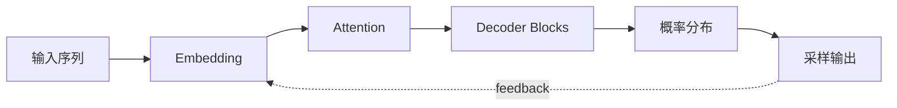

# Transformer：理解大语言模型的生成机制

## Story Explanation

当用户问“帮我写一个客户邮件”时，模型不是从数据库里取出一封邮件，而是在已有上下文基础上一步步预测下一个 token。它看起来像在思考，其实是在大规模训练中学到的模式上进行条件生成。理解这一点，能让开发者更冷静地设计提示词和系统边界。

## Technical Explanation

Transformer 通过 attention 建模 token 之间的关系。Decoder-only LLM 按自回归方式生成输出：每一步根据前文和上下文计算候选 token 概率，再由采样策略选择结果。上下文设计、停止条件、temperature、top_p 和 max_tokens 都会影响最终行为。

## Mermaid Diagram



## Python Code

```python
import random

def sample_next(candidates, temperature=0.7):
    adjusted = [(token, score / max(temperature, 0.01)) for token, score in candidates]
    total = sum(score for _, score in adjusted)
    pick = random.random() * total
    upto = 0
    for token, score in adjusted:
        upto += score
        if upto >= pick:
            return token

print(sample_next([("safe", 0.7), ("creative", 0.2), ("wild", 0.1)]))
```

See also: [example.py](example.py)

## Engineering Use Case

为代码生成工具设置较低随机性、明确停止符和输出格式，避免模型生成多余解释或未闭合代码块。

## Interview Questions

- Self-attention 解决了什么问题？
- 为什么 LLM 是逐 token 生成？
- 推理参数如何影响稳定性和创造性？

## Quality Checklist

- 解释是否能被没有框架经验的开发者理解。
- 技术概念是否能落到输入、输出、状态、工具和评估。
- Mermaid 图是否表达了系统流向。
- Python 示例是否可独立运行。
- 工程案例是否说明真实业务价值。

## Navigation

- [Previous](../01-AI-Basics/index.md)
- [Next](../03-Prompt/index.md)
