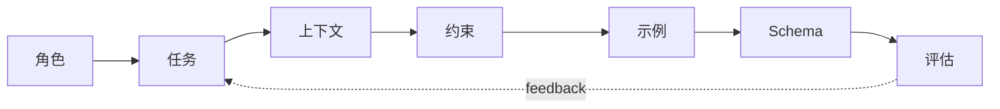

# Prompt 工程：把自然语言变成稳定接口

## Story Explanation

同一句“帮我分析客户反馈”，在不同上下文下可能得到完全不同的答案。优秀的 Prompt 不是一句灵感文案，而是一份任务协议：告诉模型扮演什么角色、使用什么资料、遵守什么约束、输出什么格式、失败时如何表达。

## Technical Explanation

工程化 Prompt 通常包含 role、task、context、constraints、examples、output schema 和 evaluation criteria。Prompt 应该版本化、可测试、可回滚。结构化输出能降低后处理成本，few-shot 示例能明确边界，评估集能避免凭感觉调参。

## Mermaid Diagram



## Python Code

```python
from string import Template

prompt = Template("""
Role: $role
Task: $task
Context: $context
Constraints: return JSON with keys: summary, risk, next_action.
""")

print(prompt.substitute(
    role="senior AI product analyst",
    task="analyze customer feedback",
    context="Users report slow onboarding."
))
```

See also: [example.py](example.py)

## Engineering Use Case

为客服质检系统设计 Prompt：输入通话摘要，输出问题分类、严重程度、证据片段和建议动作，且必须在缺少证据时返回 unknown。

## Interview Questions

- Prompt 模板应该包含哪些部分？
- 如何让模型稳定输出 JSON？
- 为什么 Prompt 也需要版本管理？

## Quality Checklist

- 解释是否能被没有框架经验的开发者理解。
- 技术概念是否能落到输入、输出、状态、工具和评估。
- Mermaid 图是否表达了系统流向。
- Python 示例是否可独立运行。
- 工程案例是否说明真实业务价值。

## Navigation

- [Previous](../02-Transformer/index.md)
- [Next](../04-RAG/index.md)
