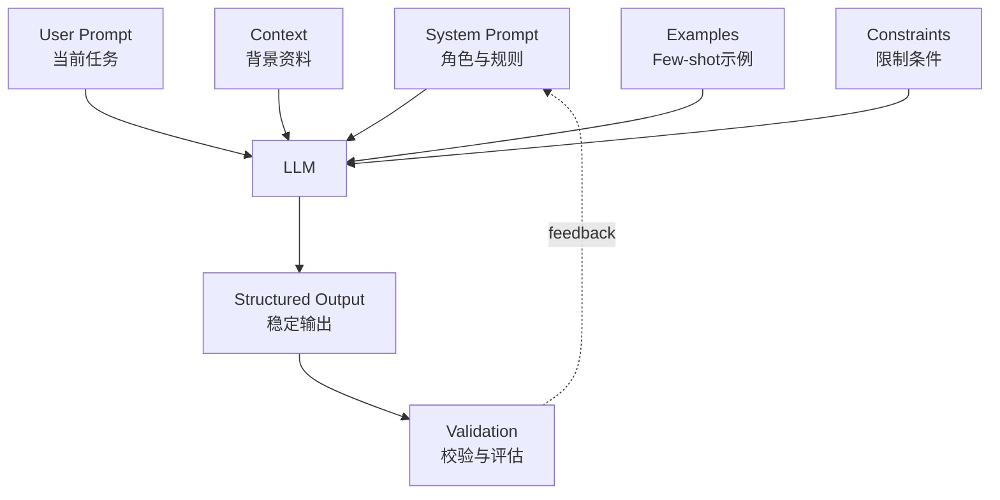

# 📘 第3章：Prompt工程（如何控制AI）

---

## 🎯 本章目标

学完本章，你将理解：

- 什么是 Prompt
- 为什么 Prompt 能控制 AI 输出
- System Prompt / User Prompt 的区别
- Few-shot 是什么
- CoT 是什么
- 如何让 AI 稳定输出

---

## 🧠 1. 什么是Prompt？

一句话：

> Prompt = 给 AI 的指令

你对 AI 说的每一句话，本质上都是 Prompt。

比如：

> 帮我写一篇文章

这句话就是 Prompt。

但在工程里，Prompt 不只是“随便问一句”。它更像是一份任务说明书：告诉 AI 你是谁、要做什么、怎么做、不能做什么、最后输出成什么格式。

---

## 📌 举例

一个很弱的 Prompt：

```text
解释 Transformer
```

一个更好的 Prompt：

```text
你是一个 AI 老师。
请用初学者能听懂的方式解释 Transformer。
要求：
- 不要使用复杂公式
- 用生活类比
- 分 3 点说明
输出格式：
1. 核心概念
2. 简单例子
3. 为什么重要
```

你会发现，第二个 Prompt 明显更可控。

---

## 🧠 2. 为什么Prompt重要？

因为：

> AI 不会主动思考目标，它只会响应输入。

如果你的输入模糊，AI 的输出也会模糊。

如果你的输入清晰，AI 的输出就更稳定。

这就是 Prompt 工程的核心：

> 用清晰的语言结构，控制 AI 的输出方向。

---

## 📌 类比

AI 像一个超级实习生：

- 你怎么说
- 他就怎么做

如果你只说：

> 做个分析

他可能不知道分析什么、给谁看、用什么格式、要不要给结论。

如果你说：

> 你是一个数据分析师，请分析这份用户反馈，找出 3 个主要问题，并按“问题-证据-建议”的格式输出。

结果就会稳定很多。

---

## ⚙️ 3. Prompt的结构

一个可用的 Prompt 一般包含：

- 角色（Role）
- 任务（Task）
- 上下文（Context）
- 限制（Constraint）
- 输出格式（Format）
- 示例（Example）

---

## 📌 示例

```text
你是一个资深 AI 工程师。

任务：
请解释 Transformer。

要求：
- 简单易懂
- 不要使用复杂数学公式
- 面向零基础读者

输出：
- 分点结构
- 每点不超过 100 字
```

这个 Prompt 比“解释 Transformer”强很多，因为它给了 AI 明确边界。

---

## 🧠 4. System vs User Prompt

| 类型 | 作用 |
|------|------|
| System Prompt | 定义 AI 身份、规则和长期行为边界 |
| User Prompt | 用户当前输入的任务和问题 |

---

## 📌 举例

System Prompt：

```text
你是一个 AI 老师，擅长用简单语言解释复杂技术。
```

User Prompt：

```text
解释 Transformer。
```

System Prompt 更像“角色设定和规则”，User Prompt 更像“当前任务”。

在真实系统中，开发者通常控制 System Prompt，用户输入 User Prompt。

---

## 🔥 5. Few-shot（示例学习）

Few-shot 的意思是：

> 给 AI 看几个例子，让它模仿模式。

例如：

```text
输入：苹果
输出：水果

输入：汽车
输出：交通工具

输入：Python
输出：
```

AI 会学习前面的模式，然后更可能输出：

```text
编程语言
```

Few-shot 的价值是：与其抽象地解释规则，不如直接给 AI 看你想要的输入输出样子。

---

## 🧠 6. CoT（思维链）

CoT 是 Chain of Thought，通常翻译为“思维链”。

它的核心思想是：

> 让 AI 分步骤推理，而不是直接给答案。

比如：

```text
请一步一步分析这个问题，再给出最终答案。
```

效果通常是：

- 更准确
- 更稳定
- 更容易发现中间错误

但在工程中要注意：不是所有场景都应该暴露完整推理过程。有些系统更适合让模型内部推理，最终只输出简洁结论和依据。

---

## ⚙️ 7. Prompt工程核心技巧

Prompt 工程最重要的技巧包括：

- 明确角色
- 明确任务
- 提供上下文
- 限制输出范围
- 指定输出格式
- 提供示例
- 告诉 AI 不确定时如何回答

尤其是最后一点非常关键。

如果资料不足，你应该要求 AI 说：

```text
无法根据现有信息确认。
```

而不是让它自由编造。

---

## 📊 8. Prompt结构模板

一个常用模板：

```text
你是：{角色}

任务：{任务}

背景信息：
{上下文}

要求：
- {限制1}
- {限制2}
- {限制3}

输出格式：
{格式}

如果信息不足：
请回答“无法根据现有信息确认”。
```

这个模板可以用于总结、分类、改写、代码生成、报告生成、RAG 问答等很多场景。

---

## Mermaid Diagram



---

## Python Code

下面用 Python 构造一个 Prompt 模板。

```python
from string import Template

prompt_template = Template("""
你是：$role

任务：$task

背景信息：
$context

要求：
- $constraint_1
- $constraint_2

输出格式：
$output_format

如果信息不足，请回答：无法根据现有信息确认。
""")

prompt = prompt_template.substitute(
    role="资深 AI 工程师",
    task="解释 Transformer",
    context="读者是零基础开发者",
    constraint_1="不要使用复杂公式",
    constraint_2="使用生活类比",
    output_format="分点输出：核心概念、简单例子、为什么重要",
)

print(prompt)
```

See also: [example.py](example.py)

---

## Engineering Use Case

假设你正在做一个客服质检系统。

用户输入是一段客服对话，你希望 AI 输出：

- 问题分类
- 严重程度
- 证据片段
- 建议动作

错误做法是：

```text
分析这段客服对话。
```

正确做法是：

```text
你是客服质检专家。
请分析以下客服对话。

要求：
- 只能基于对话内容判断
- 如果证据不足，返回 unknown
- 输出 JSON

JSON 字段：
- category
- severity
- evidence
- next_action
```

这就是 Prompt 从“聊天”变成“工程接口”的关键。

---

## 🎯 9. 面试常问

什么是 Prompt？

> Prompt 是控制 AI 输出的输入指令。

Few-shot 是什么？

> Few-shot 是通过示例教 AI 模仿输入输出模式。

为什么 Prompt 重要？

> 因为 AI 完全依赖输入。输入越清晰，输出越稳定。

System Prompt 和 User Prompt 有什么区别？

> System Prompt 定义角色和规则，User Prompt 提供当前任务。

如何让 AI 稳定输出？

> 明确角色、任务、限制、格式、示例，并加入输出校验。

---

## 📌 本章总结

- Prompt = 控制 AI 的方式
- 结构越清晰，输出越稳定
- System Prompt 定义身份和规则
- User Prompt 定义当前任务
- Few-shot 用例子教 AI
- CoT 让 AI 分步骤分析
- Prompt 本质上是指挥 AI 的语言

---

## Quality Checklist

- 能否解释 Prompt 为什么能控制 AI 输出。
- 能否区分 System Prompt 和 User Prompt。
- 能否写出包含角色、任务、限制和格式的 Prompt。
- 能否解释 Few-shot 和 CoT。
- 能否把 Prompt 设计成工程接口，而不是随便聊天。

---

## Navigation

- [Previous](../02-Transformer/index.md)
- [Next](../04-RAG/index.md)
