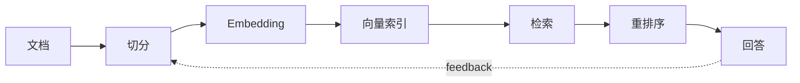

# RAG：让模型基于外部知识回答

## Story Explanation

公司制度每天都在变化，如果只靠模型参数回答员工问题，答案很可能过时。RAG 的思路是：先检索最新可信资料，再让模型基于资料回答。模型不再假装什么都知道，而是围绕证据组织语言。

## Technical Explanation

RAG 包括文档导入、切分、embedding、索引、检索、重排序、上下文组装和 grounded generation。核心质量取决于检索是否召回正确资料、上下文是否足够干净、回答是否忠于证据。权限、元数据和引用也是生产系统必须处理的问题。

## Mermaid Diagram



## Python Code

```python
from math import sqrt

def dot(a, b):
    return sum(x * y for x, y in zip(a, b))

def norm(v):
    return sqrt(sum(x * x for x in v))

def cosine(a, b):
    return dot(a, b) / (norm(a) * norm(b) or 1)

docs = {"policy": [0.9, 0.1], "pricing": [0.2, 0.8]}
query = [0.8, 0.2]
print(max(docs, key=lambda name: cosine(query, docs[name])))
```

See also: [example.py](example.py)

## Engineering Use Case

企业知识库助手根据员工问题检索制度文档，返回答案时附上引用来源，并在没有足够证据时拒绝编造。

## Interview Questions

- 如何选择 chunk size？
- 向量检索和关键词检索如何互补？
- 如何评估 RAG 是否真的基于证据？

## Quality Checklist

- 解释是否能被没有框架经验的开发者理解。
- 技术概念是否能落到输入、输出、状态、工具和评估。
- Mermaid 图是否表达了系统流向。
- Python 示例是否可独立运行。
- 工程案例是否说明真实业务价值。

## Navigation

- [Previous](../03-Prompt/index.md)
- [Next](../05-Agent/index.md)
