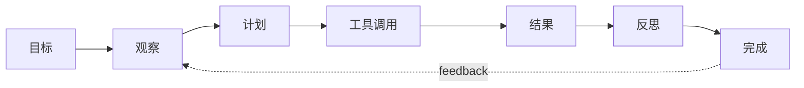

# Agent：目标、工具、记忆和行动循环

## Story Explanation

用户说“帮我整理这个月的项目风险并给团队发一封邮件”。普通 LLM 可以写邮件，但 Agent 需要先理解目标、查项目数据、识别风险、生成草稿、等待确认，再调用邮件工具。它必须能行动，也必须能被约束。

## Technical Explanation

Agent 的基本循环是 observe、think、act、reflect。LLM 负责决策，工具负责执行确定性动作，状态记录过程，策略控制权限和终止条件。生产级 Agent 必须有最大步数、工具 schema、审计日志、失败恢复和人工确认。

## Mermaid Diagram



## Python Code

```python
def search_tool(query: str) -> str:
    return f"evidence for: {query}"

def agent(goal: str, max_steps: int = 3):
    state = {"goal": goal, "evidence": [], "done": False}
    for _ in range(max_steps):
        if not state["evidence"]:
            state["evidence"].append(search_tool(goal))
        else:
            state["done"] = True
            return state
    state["needs_human_review"] = True
    return state

print(agent("summarize project risk"))
```

See also: [example.py](example.py)

## Engineering Use Case

研发助手读取 issue 列表、识别阻塞任务、生成修复建议，并在创建 pull request 前请求开发者确认。

## Interview Questions

- Agent 和 chatbot 的区别是什么？
- 工具调用为什么需要 schema？
- 如何防止 Agent 无限循环？

## Quality Checklist

- 解释是否能被没有框架经验的开发者理解。
- 技术概念是否能落到输入、输出、状态、工具和评估。
- Mermaid 图是否表达了系统流向。
- Python 示例是否可独立运行。
- 工程案例是否说明真实业务价值。

## Navigation

- [Previous](../04-RAG/index.md)
- [Next](../06-LangGraph/index.md)
