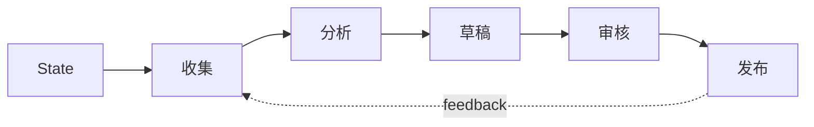

# LangGraph：用图编排可控 Agent 工作流

## Story Explanation

一开始，一个 while 循环就能跑 Agent。但当流程出现多个分支、人工审核、失败重试和长期状态时，循环会越来越难维护。图结构让每个节点、每条边、每次状态变化都更清楚。

## Technical Explanation

LangGraph 的核心思想是 StateGraph：State 保存共享数据，Node 处理状态，Edge 决定下一步。条件路由、检查点和可恢复执行让 Agent 从脚本变成可管理工作流。即使不用具体框架，图式思维也适合设计复杂 Agent。

## Mermaid Diagram



## Python Code

```python
def collect(state):
    state["data"] = [3, 7, 12]
    return state

def analyze(state):
    state["risk"] = max(state["data"]) > 10
    return state

def draft(state):
    state["message"] = "risk detected" if state["risk"] else "normal"
    return state

state = {}
for node in (collect, analyze, draft):
    state = node(state)
print(state)
```

See also: [example.py](example.py)

## Engineering Use Case

把报告生成 Agent 拆成“收集数据、分析异常、生成草稿、人工审核、发布报告”五个节点，每个节点都有输入输出和失败出口。

## Interview Questions

- 为什么图比单循环更适合复杂 Agent？
- State 应该如何设计？
- 检查点在生产工作流中有什么价值？

## Quality Checklist

- 解释是否能被没有框架经验的开发者理解。
- 技术概念是否能落到输入、输出、状态、工具和评估。
- Mermaid 图是否表达了系统流向。
- Python 示例是否可独立运行。
- 工程案例是否说明真实业务价值。

## Navigation

- [Previous](../05-Agent/index.md)
- [Next](../07-MCP/index.md)
