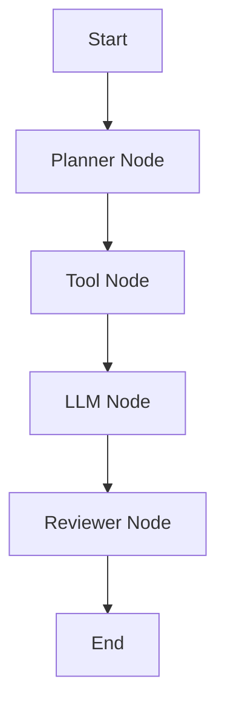

# 📘 第7章：LangGraph（AI Agent编排系统）

---

# 🎯 本章目标

学完本章你将理解：

- 为什么需要LangGraph
- 什么是Graph结构
- Node / Edge / State是什么
- 如何编排多个Agent
- 为什么Agent需要“流程控制”
- 企业级Agent如何设计

---

# 🧠 1. 为什么需要LangGraph？

在前面你已经学过：

- LLM（只会回答）
- Agent（会调用工具）
- Tool Calling（能执行动作）

但是问题来了：

> ❌ Agent是“无序执行”的

---

## 📌 举例

一个复杂任务：

> 写一份电商分析报告

需要：

- 搜索数据
- 分析数据
- 写报告
- 检查质量

---

如果没有结构：

👉 Agent会乱执行  
👉 顺序不稳定  
👉 结果不可控

---

# 🧠 2. LangGraph是什么？

一句话：

> LangGraph = 用“图结构”控制Agent流程

---

## 📌 核心思想

不是线性执行，而是：

> Graph（图结构）执行

---

# 🧠 3. Graph结构

```text
Node = 执行步骤
Edge = 流程连接
State = 共享数据
```

---

# 📊 4. LangGraph结构图



---

# 🧠 5. 三个核心概念

---

## 1️⃣ Node（节点）

一个执行单元：

- LLM
- Tool
- Function
- Agent

---

## 2️⃣ Edge（边）

控制流程：

- A → B
- B → C

---

## 3️⃣ State（状态）

全局数据：

- 用户输入
- 中间结果
- 工具返回

---

# 🧠 6. 为什么需要Graph？

因为：

LLM + Agent 的问题是：

- ❌ 无法控制流程
- ❌ 容易乱跳步骤
- ❌ 不稳定

---

Graph解决：

> ✔ 可控流程  
> ✔ 可重复执行  
> ✔ 可调试  

---

# 🧠 7. Agent vs LangGraph

| 类型 | 特点 |
|------|------|
| Agent | 自由执行 |
| LangGraph | 可控流程 |

---

# 🧠 8. 一个真实流程

电商分析Agent：

```text
用户输入
   ↓
Planner Node（规划）
   ↓
Search Node（数据）
   ↓
Analysis Node（分析）
   ↓
Writer Node（写报告）
   ↓
Reviewer Node（检查）
   ↓
输出结果
```

---

# 💻 9. 简化代码理解

```python
state = {}

def node1(state):
    state["plan"] = "search data"
    return state

def node2(state):
    state["data"] = "result"
    return state
```

---

# 🧠 10. LangGraph的本质

一句话：

> LangGraph = 可控的Agent系统执行框架

---

# 🧠 11. 为什么企业喜欢LangGraph？

因为：

- 可控
- 可调试
- 可扩展
- 可监控

---

# 🎯 12. 面试常问

---

## ❓ LangGraph是什么？

> 用图结构控制AI Agent流程的框架

---

## ❓ Node和Edge是什么？

- Node = 执行步骤
- Edge = 流程连接

---

## ❓ 为什么不用普通Agent？

> 因为不稳定、不可控

---

# 📌 本章总结

- LangGraph = 图结构Agent
- Node = 执行单元
- Edge = 流程
- State = 数据

---

## Engineering Use Case

复杂 Agent 任务不能只靠自由循环。电商分析报告可以拆成 Planner、Search、Analysis、Writer、Reviewer 五个节点，每个节点读写同一个 State，让流程可控、可调试、可恢复。

---

## Mermaid Diagram


---

## Python Code

```python
state = {}


def planner_node(state):
    state["plan"] = "search data -> analyze -> write report"
    return state


def tool_node(state):
    state["data"] = "sales increased, conversion dropped"
    return state


def writer_node(state):
    state["report"] = f"Plan: {state['plan']} | Data: {state['data']}"
    return state


for node in (planner_node, tool_node, writer_node):
    state = node(state)

print(state["report"])
```

See also: [example.py](example.py)

---

## Quality Checklist

- 能否用一句话解释本章核心概念。
- 能否画出本章系统流程。
- 能否运行 Python 示例理解核心机制。
- 能否说明企业工程场景如何落地。
- 能否回答本章高频面试题。

---

## Navigation

- [Previous](../06-Tools-FunctionCalling/index.md)
- [Next](../08-MCP/index.md)

