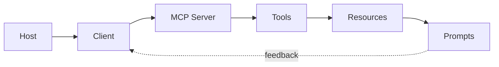

# MCP：标准化连接工具和上下文

## Story Explanation

每个 AI 应用都自己接数据库、文件系统和业务 API，会导致重复开发和权限混乱。MCP 提供一种统一接口，让客户端以标准方式发现工具、读取资源、使用提示模板。

## Technical Explanation

MCP 架构包含 Host、Client 和 Server。Server 暴露 tools、resources 和 prompts；Client 负责通信；Host 面向用户组织体验。MCP 的价值是解耦 AI 应用和外部能力，但安全边界、权限确认和审计仍然必须由系统设计保证。

## Mermaid Diagram



## Python Code

```python
import json

server = {
    "name": "knowledge-base",
    "tools": [{"name": "search_docs", "input_schema": {"query": "string"}}],
    "resources": [{"uri": "kb://policies", "description": "Company policies"}],
}
print(json.dumps(server, ensure_ascii=False, indent=2))
```

See also: [example.py](example.py)

## Engineering Use Case

为内部知识库开发 MCP Server，暴露 search_docs 工具、policy 文档资源和 report_prompt 模板，供多个 AI 客户端复用。

## Interview Questions

- MCP 解决了什么集成问题？
- Tools 和 Resources 有什么区别？
- MCP Server 为什么需要最小权限？

## Quality Checklist

- 解释是否能被没有框架经验的开发者理解。
- 技术概念是否能落到输入、输出、状态、工具和评估。
- Mermaid 图是否表达了系统流向。
- Python 示例是否可独立运行。
- 工程案例是否说明真实业务价值。

## Navigation

- [Previous](../06-LangGraph/index.md)
- [Next](../08-Projects/index.md)
