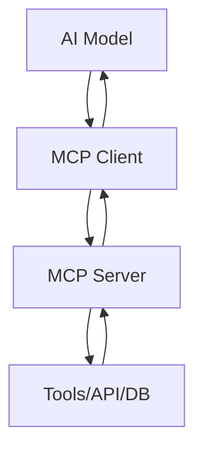

# 📘 第8章：MCP（Model Context Protocol）

---

# 🎯 本章目标

学完本章你将理解：

- MCP是什么
- 为什么需要统一协议
- Agent如何连接工具生态
- MCP和Function Calling区别
- 企业为什么要用MCP
- AI工具化的未来架构

---

# 🧠 1. MCP是什么？

一句话：

> MCP = AI连接工具的“统一协议”

---

## 📌 类比理解

你可以把MCP想象成：

> USB-C接口

---

### 在MCP之前：

每个工具都要单独对接：

- OpenAI tools
- Claude tools
- LangChain tools
- 自定义API

👉 非常混乱

---

### MCP之后：

统一接口：

> 一个协议 → 所有工具通用

---

# 🧠 2. 为什么需要MCP？

因为现在AI工具生态很乱：

- 每个模型接口不一样
- 每个工具调用方式不同
- 难以扩展
- 难以维护

---

## ❌ 没有MCP的问题

- 工具无法复用
- Agent无法跨平台
- 开发成本极高

---

## ✔ MCP解决：

> 标准化AI与工具通信

---

# 🧠 3. MCP核心结构

MCP由三部分组成：

```text
Client（AI）
Server（工具提供方）
Protocol（通信协议）
```

---

# 📊 4. MCP架构图



---

# 🧠 5. MCP vs Function Calling

| 对比 | Function Calling | MCP |
|------|-----------------|-----|
| 目标 | 单模型工具调用 | 标准化生态 |
| 范围 | 单应用 | 多系统 |
| 扩展性 | 弱 | 强 |
| 标准 | 无统一 | 有协议 |

---

# 🧠 6. MCP解决什么问题？

---

## ❌ 以前：

每个Agent都要写：

- tool接口
- API格式
- 参数结构

---

## ✔ MCP之后：

只需要：

> 插拔式工具系统

---

# 🧠 7. MCP工作流程

```text
AI发起请求
   ↓
MCP Client
   ↓
MCP Server
   ↓
执行工具（数据库 / API / 文件系统）
   ↓
返回结果
   ↓
AI继续推理
```

---

# 🧠 8. MCP的本质

一句话：

> MCP = AI时代的“工具操作系统”

---

# 🧠 9. MCP的应用场景

---

## 📌 1. AI编程

- 读代码
- 改代码
- 执行测试

---

## 📌 2. 数据分析

- 查询数据库
- 生成报表
- 可视化

---

## 📌 3. 企业系统

- CRM
- ERP
- BI系统

---

# 🧠 10. MCP vs Agent

| 类型 | 作用 |
|------|------|
| Agent | 决策 |
| MCP | 工具连接 |

---

👉 本质关系：

> Agent = 大脑  
> MCP = 神经接口

---

# 🧠 11. 为什么MCP很重要？

因为未来AI不是单模型，而是：

> 多模型 + 多工具 + 多系统

---

# 🧠 12. MCP未来趋势

未来AI系统会变成：

- 插件化
- 工具化
- 服务化

---

# 🎯 13. 面试常问

---

## ❓ MCP是什么？

> AI与工具之间的标准通信协议

---

## ❓ MCP解决什么问题？

- 工具碎片化
- 系统不统一
- 难扩展

---

## ❓ MCP和Function Calling区别？

- Function Calling：单点能力
- MCP：生态协议

---

# 📌 本章总结

- MCP = AI工具统一协议
- 解决工具碎片化问题
- 让AI系统可扩展

---

## Engineering Use Case

MCP 适合把企业工具做成统一协议层。不同 AI 客户端不需要分别对接 CRM、数据库、文件系统，而是通过 MCP Server 发现工具、读取资源、执行受控操作。

---

## Mermaid Diagram


---

## Python Code

```python
mcp_server = {
    "name": "company-tools",
    "tools": [
        {"name": "search_docs", "description": "搜索企业文档"},
        {"name": "query_crm", "description": "查询客户系统"},
    ],
    "resources": ["docs://policies", "crm://customers"],
}

for tool in mcp_server["tools"]:
    print(f"MCP Tool: {tool['name']} - {tool['description']}")
```

See also: [example.py](example.py)

---

## Quality Checklist

- 能否用一句话解释本章核心概念。
- 能否画出本章系统流程。
- 能否运行 Python 示例理解核心机制。
- 能否说明企业工程场景如何落地。
- 能否回答本章高频面试题。

---

## Navigation

- [Previous](../07-LangGraph/index.md)
- [Next](../09-AI-Agent-Projects/index.md)

