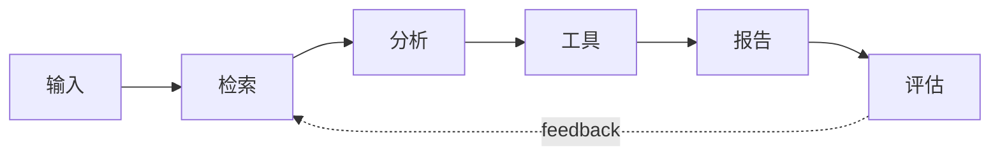

# 项目实战：从最小闭环到多步骤 Agent

## Story Explanation

学习 AI Agent 最快的方法不是读完所有概念，而是做一个能跑、能坏、能修的项目。从最小 LLM 应用开始，再加入 RAG、工具调用、状态管理和评估，开发者会逐渐看到系统复杂度如何出现。

## Technical Explanation

项目应按层组织：interface、prompt、model、retrieval、tools、orchestration、evaluation、observability。每个项目都要有运行入口、配置、测试样例和失败记录。工程项目的重点是可重复，而不是一次性演示成功。

## Mermaid Diagram



## Python Code

```python
from pathlib import Path

folders = ["app", "prompts", "tools", "retrieval", "evals", "logs"]
for folder in folders:
    Path(folder).mkdir(exist_ok=True)
print("project skeleton ready")
```

See also: [example.py](example.py)

## Engineering Use Case

构建一个“研究报告 Agent”：输入主题，检索资料，生成提纲，补充引用，输出 Markdown 报告，并记录每一步证据。

## Interview Questions

- 一个 AI 项目的最小闭环是什么？
- 项目目录如何分层？
- 如何把 demo 改造成可维护工程？

## Quality Checklist

- 解释是否能被没有框架经验的开发者理解。
- 技术概念是否能落到输入、输出、状态、工具和评估。
- Mermaid 图是否表达了系统流向。
- Python 示例是否可独立运行。
- 工程案例是否说明真实业务价值。

## Navigation

- [Previous](../07-MCP/index.md)
- [Next](../09-SystemDesign/index.md)
