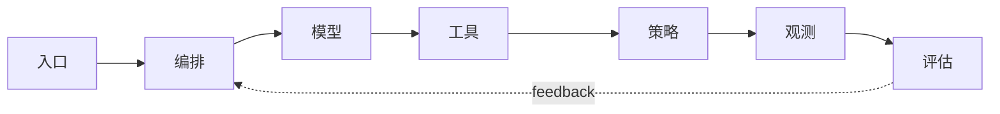

# 系统设计：可靠、可观测、可治理的 Agent

## Story Explanation

当 Agent 进入真实业务，问题不再只是“回答得好不好”，还包括成本是否可控、日志是否完整、失败是否可恢复、权限是否安全、输出是否可审计。系统设计决定 Agent 能否从玩具走向生产。

## Technical Explanation

生产级 Agent 架构通常包含入口层、编排层、模型层、工具层、数据层、策略层、评估层和观测层。关键能力包括超时、重试、幂等、降级、人工接管、权限控制、成本监控和质量评估。

## Mermaid Diagram



## Python Code

```python
from datetime import datetime
import json

def log_event(step, model, cost, status):
    event = {
        "time": datetime.utcnow().isoformat(),
        "step": step,
        "model": model,
        "cost_usd": cost,
        "status": status,
    }
    print(json.dumps(event, ensure_ascii=False))

log_event("tool_call", "gpt-class", 0.002, "success")
```

See also: [example.py](example.py)

## Engineering Use Case

设计企业级客服 Agent：低风险问题自动回答，高风险问题升级人工，所有回答保留证据、置信度、成本和用户反馈。

## Interview Questions

- Agent 系统有哪些典型失败模式？
- 如何设计人工接管？
- 质量、成本和延迟如何一起优化？

## Quality Checklist

- 解释是否能被没有框架经验的开发者理解。
- 技术概念是否能落到输入、输出、状态、工具和评估。
- Mermaid 图是否表达了系统流向。
- Python 示例是否可独立运行。
- 工程案例是否说明真实业务价值。

## Navigation

- [Previous](../08-Projects/index.md)
- [Next](../10-Interview/index.md)
