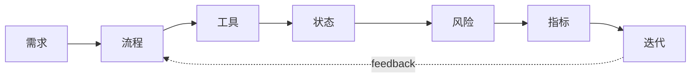

# 面试准备：把 Agent 能力讲成系统能力

## Story Explanation

很多候选人能解释 RAG 或工具调用，但一到系统设计题就只会说“调用大模型”。真正的 Agent 面试考察的是工程判断：如何拆任务、如何控制风险、如何评估效果、如何解释取舍。

## Technical Explanation

面试回答应采用结构化框架：需求澄清、能力边界、核心流程、数据与工具、状态管理、失败处理、安全策略、评估指标和迭代计划。不要把模型能力当成万能答案，要说明系统如何约束和验证模型。

## Mermaid Diagram



## Python Code

```python
framework = [
    "clarify requirements",
    "define workflow",
    "choose tools and data",
    "design state and recovery",
    "set metrics and review loop",
]

for item in framework:
    print(f"- {item}")
```

See also: [example.py](example.py)

## Engineering Use Case

回答“设计一个自动生成周报的 Agent”时，先澄清数据源和权限，再设计检索、分析、草稿、审核、发布和反馈闭环。

## Interview Questions

- 如何设计一个企业知识库 Agent？
- 如何评估 Agent 是否比人工流程更好？
- 当 Agent 调错工具时如何排查？

## Quality Checklist

- 解释是否能被没有框架经验的开发者理解。
- 技术概念是否能落到输入、输出、状态、工具和评估。
- Mermaid 图是否表达了系统流向。
- Python 示例是否可独立运行。
- 工程案例是否说明真实业务价值。

## Navigation

- [Previous](../09-SystemDesign/index.md)
- [Next](../README.md)
