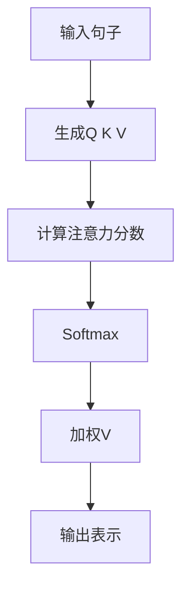

# 📘 第2章：Transformer是什么（完整版教材）

---

# 🎯 本章目标

学完本章，你将彻底理解：

- Transformer解决了什么问题
- Attention的本质
- QKV机制
- 为什么RNN被淘汰
- ChatGPT为什么能理解上下文

---

# 🧠 1. 为什么需要Transformer？

在Transformer出现之前，主流模型是RNN。

但RNN有一个致命问题：

> ❌ 不能并行计算
> ❌ 长文本容易“遗忘”

---

## 📌 举例理解

句子：

> 我把苹果放在桌子上，因为它很重。

RNN要一步一步读：

- 读“我”
- 读“把”
- 读“苹果”
- ……

问题：

👉 到“它”时，已经忘了前面的“苹果”

---

# 🚀 2. Transformer的核心思想

一句话：

> Transformer = 让模型“同时看到整个句子”

---

# 🧠 3. Attention机制是什么？

Attention = 注意力机制

本质：

> 找到最重要的信息

---

## 📌 类比（非常重要）

你在读一句话：

你会自动判断：

- 哪些词重要
- 哪些词不重要

例如：

“苹果”“重”比“的”“因为”更重要

---

# 🧠 4. QKV机制（核心）

每个词有三个向量：

| 角色 | 含义 |
|------|------|
| Q | 我想找什么 |
| K | 我有什么标签 |
| V | 我提供的信息 |

---

## 📌 类比（图书馆）

你去图书馆：

- Q = 你想找什么书
- K = 每本书的标签
- V = 书的内容

---

# ⚙️ 5. Attention计算流程

```text
Q × K → 相似度
↓
Softmax归一化
↓
加权V
↓
输出结果
```

---

# 📊 6. Transformer结构图



---

# 💻 7. 简化Python理解

```python
def attention(q, k, v):
    scores = [q * ki for ki in k]
    weights = softmax(scores)
    return sum(w * vi for w, vi in zip(weights, v))
```

---

# 🧠 8. 为什么Transformer比RNN强？

## ✔ Transformer：

- 可以并行计算
- 可以看全局
- 不会遗忘

## ❌ RNN：

- 逐步计算
- 容易遗忘
- 速度慢

---

# 🔥 9. ChatGPT为什么厉害？

因为：

> Transformer + 大数据 + 大参数

---

# 🎯 10. 面试常问

---

## ❓ Attention是什么？

> 计算“哪些信息更重要”的机制

---

## ❓ QKV是什么？

- Q：查询
- K：键
- V：值

---

## ❓ Transformer解决了什么？

- 长距离依赖问题
- 不能并行的问题

---

# 📌 本章总结

- Transformer = Attention机制
- Attention = 信息加权
- QKV = 信息匹配系统
