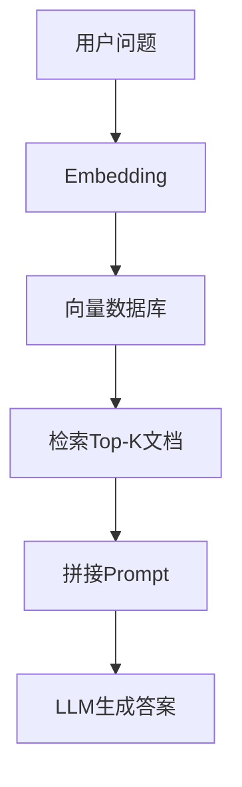

# 📘 第4章：RAG（检索增强生成）

---

# 🎯 本章目标

学完本章你将理解：

- 什么是RAG
- 为什么LLM需要RAG
- 向量数据库在做什么
- Embedding是什么
- RAG如何减少幻觉
- 企业如何用RAG

---

# 🧠 1. 为什么需要RAG？

LLM有一个问题：

> ❌ 它不知道“最新知识”

例如：

- 最新公司制度
- 最新股票价格
- 私有文档内容

---

## 📌 举例

你问：

> 公司年假是多少天？

LLM可能：

👉 编一个答案（幻觉）

---

## 👉 解决方案：

RAG（Retrieval Augmented Generation）

---

# 🧠 2. RAG是什么？

一句话：

> RAG = 先查资料，再回答

---

## 📌 流程

```text
用户问题
   ↓
检索系统（Search）
   ↓
找到相关资料
   ↓
交给LLM
   ↓
生成答案
```

---

# 🧠 3. RAG核心结构

RAG由三部分组成：

- Embedding（向量化）
- Vector Database（向量数据库）
- LLM（生成）

---

# 🧠 4. Embedding是什么？

Embedding = 把文字变成数字

---

## 📌 类比

一句话：

> “苹果很好吃”

变成：

```
[0.12, -0.98, 0.33, ...]
```

---

## 👉 为什么要这样？

因为：

> 计算机只能处理数字

---

# 🧠 5. 向量数据库在做什么？

它做一件事：

> 找“最相似的内容”

---

## 📌 类比

你问：

> 什么是AI？

系统会找：

- AI介绍文章
- 机器学习文档
- Transformer解释

---

# 🧠 6. RAG完整流程

```text
用户问题
   ↓
Embedding
   ↓
向量数据库检索
   ↓
找到相关内容
   ↓
拼接Prompt
   ↓
LLM生成答案
```

---

# 📊 7. RAG架构图



---

# 🧠 8. 为什么RAG能减少幻觉？

因为：

- LLM不再“猜”
- 而是“有资料参考”

---

## ❌ 没RAG：

LLM = 闭卷考试

---

## ✔ 有RAG：

LLM = 开卷考试

---

# 🧠 9. 企业为什么用RAG？

因为：

- 可以接私有数据
- 不用重新训练模型
- 成本低
- 更新快

---

# 💻 10. 极简代码理解

```python
def rag(query, docs):
    related_docs = search(docs, query)
    context = "
".join(related_docs)
    return llm(query + context)
```

---

# 🎯 11. 面试常问

---

## ❓ 什么是RAG？

> 检索增强生成，让LLM先查资料再回答

---

## ❓ RAG解决什么问题？

- 幻觉问题
- 知识更新问题

---

## ❓ Embedding是什么？

> 将文本转换为向量表示

---

# 📌 本章总结

- RAG = 检索 + LLM生成
- Embedding = 文本向量化
- Vector DB = 相似度搜索
