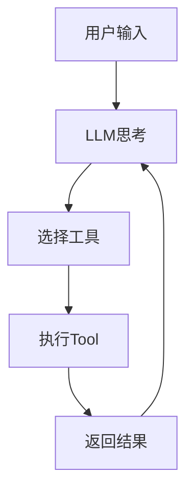

# 📘 第5章：Agent（AI如何真正“干活”）

---

# 🎯 本章目标

学完本章你将理解：

- 什么是Agent
- 为什么LLM本身不能执行任务
- Tool / Function Calling是什么
- ReAct是什么
- AI如何“思考+行动”
- 多Agent系统是什么

---

# 🧠 1. 什么是Agent？

一句话：

> Agent = 能思考 + 能执行任务的AI系统

---

## 📌 对比理解

| 类型 | 能力 |
|------|------|
| LLM | 只能回答问题 |
| Agent | 能执行任务 |

---

## 📌 举例

### LLM：

你说：

> 帮我订机票

它回答：

> 可以去携程订票

---

### Agent：

它会：

- 打开网页
- 搜索航班
- 选择时间
- 填写信息
- 完成订票

---

# 🧠 2. 为什么需要Agent？

因为：

> LLM只有“脑子”，没有“手”

---

Agent =

> 大脑（LLM） + 手（工具）

---

# 🧠 3. Agent结构

```text
用户
 ↓
LLM（思考）
 ↓
决定是否调用工具
 ↓
Tool执行
 ↓
返回结果
 ↓
LLM继续思考
```

---

# 🧠 4. Tool / Function Calling

Tool Calling = 让AI使用外部工具

---

## 📌 举例

用户：

> 查一下北京天气

LLM输出：

```json
{
  "tool": "weather",
  "location": "北京"
}
```

---

系统执行：

```text
调用天气API
```

---

返回结果：

> 北京今天 18°C

---

# 🧠 5. ReAct（核心方法）

ReAct =

> Reasoning（思考） + Acting（行动）

---

## 📌 流程

```text
思考 → 行动 → 观察 → 再思考 → 再行动
```

---

## 📌 类比

像一个人：

- 想一步
- 做一步
- 看结果
- 再调整

---

# 🧠 6. Agent工作循环

```text
Think → Act → Observe → Repeat
```

---

# 📊 7. Agent架构图



---

# 🧠 8. 多Agent系统

多个Agent协作：

---

## 📌 举例

| Agent | 作用 |
|------|------|
| Planner | 规划任务 |
| Writer | 写内容 |
| Reviewer | 检查 |
| Tool Agent | 执行操作 |

---

## 📌 类比公司

- CEO（规划）
- 员工（执行）
- 审核（质量控制）

---

# 🧠 9. Agent vs LLM

| 对比 | LLM | Agent |
|------|-----|-------|
| 能否行动 | ❌ | ✔ |
| 是否调用工具 | ❌ | ✔ |
| 是否有循环 | ❌ | ✔ |

---

# 💻 10. 简化代码理解

```python
def agent(user_input):
    thought = llm(user_input)

    if need_tool(thought):
        result = tool(thought)
        return llm(result)

    return thought
```

---

# 🧠 11. Agent的本质

一句话：

> Agent = 会使用工具的LLM

---

# 🎯 12. 面试常问

---

## ❓ 什么是Agent？

> 能使用工具并完成任务的AI系统

---

## ❓ Agent和LLM区别？

- LLM：只能回答
- Agent：能执行任务

---

## ❓ ReAct是什么？

> 思考 + 行动的循环机制

---

# 📌 本章总结

- Agent = LLM + 工具 + 循环
- ReAct = 思考+行动
- Tool Calling = AI使用外部能力
