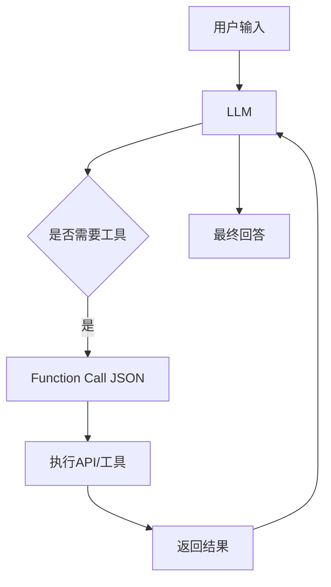

# 📘 第6章：Tools & Function Calling（让AI真正“动手”）

---

# 🎯 本章目标

学完本章你将理解：

- 什么是Function Calling
- 为什么AI需要工具
- JSON Schema在做什么
- Tool调用完整流程
- Agent如何连接外部世界
- 企业如何使用工具系统

---

# 🧠 1. 为什么需要Tools？

LLM有一个核心问题：

> ❌ 它只能“说”，不能“做”

---

## 📌 举例

你说：

> 查一下北京天气

LLM：

> 北京天气很好（可能是编的）

---

## 👉 问题本质：

LLM没有：

- 互联网
- 数据库
- API
- 系统权限

---

# 🧠 2. Tools是什么？

一句话：

> Tools = 给AI“外部能力”

---

## 📌 类比

AI = 大脑  
Tools = 手 + 工具

---

# 🧠 3. Function Calling是什么？

Function Calling =

> AI决定调用哪个函数 + 传什么参数

---

## 📌 示例

用户：

> 查北京天气

LLM输出：

```json
{
  "function": "get_weather",
  "arguments": {
    "city": "北京"
  }
}
```

---

系统执行：

```text
调用 weather API
```

---

返回：

> 北京 18°C

---

# 🧠 4. Tool调用流程

```text
用户输入
   ↓
LLM分析
   ↓
判断是否需要工具
   ↓
生成JSON调用
   ↓
系统执行工具
   ↓
返回结果给LLM
   ↓
LLM生成最终回答
```

---

# 📊 5. Tool调用架构图



---

# 🧠 6. JSON Schema是什么？

JSON Schema =

> 定义函数输入格式的规则

---

## 📌 示例

```json
{
  "name": "get_weather",
  "parameters": {
    "type": "object",
    "properties": {
      "city": {
        "type": "string"
      }
    }
  }
}
```

---

# 🧠 7. 为什么需要Schema？

因为：

- 防止AI乱输出
- 保证参数正确
- 方便系统执行

---

# 🧠 8. Tool vs Prompt区别

| 类型 | 作用 |
|------|------|
| Prompt | 控制AI说什么 |
| Tool | 让AI做什么 |

---

# 🧠 9. 多Tool系统

一个Agent可以用多个工具：

---

## 📌 示例

- 天气API
- 搜索引擎
- 数据库
- 计算器
- 邮件系统

---

## 📌 类比

AI = 操作系统  
Tools = 软件应用

---

# 🧠 10. 企业级Tool系统

企业Agent通常包含：

- CRM系统
- ERP系统
- 数据库
- API网关
- 搜索系统

---

# 💻 11. 简化代码理解

```python
def function_call(user_input):
    if "天气" in user_input:
        return call_weather_api()
    else:
        return llm(user_input)
```

---

# 🧠 12. Tool Calling的本质

一句话：

> 让AI具备“执行能力”

---

# 🎯 13. 面试常问

---

## ❓ 什么是Function Calling？

> AI通过结构化JSON调用外部函数

---

## ❓ Tool有什么作用？

> 扩展AI能力边界

---

## ❓ 为什么需要Schema？

> 保证参数结构正确

---

# 📌 本章总结

- Tool = AI外部能力
- Function Calling = AI调用函数
- Schema = 结构约束
- Agent = LLM + Tools
