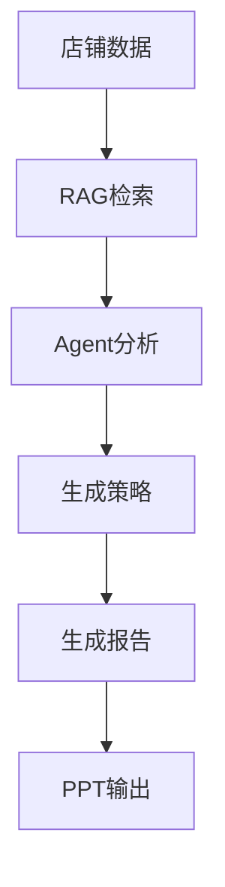
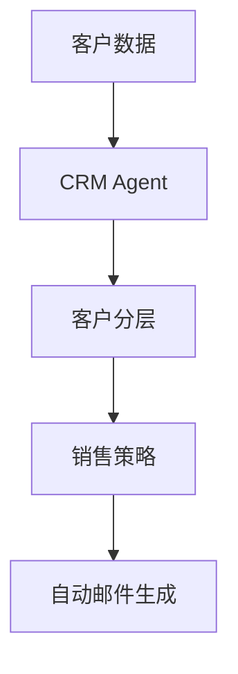
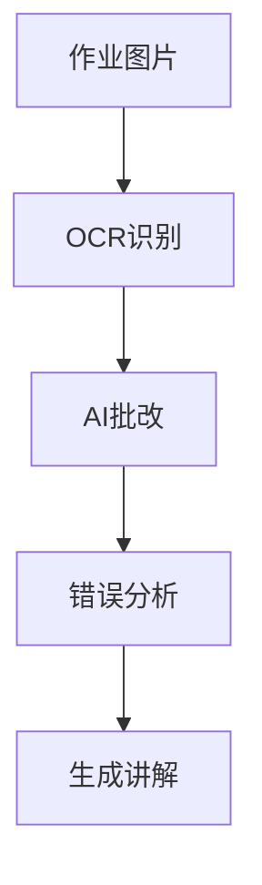
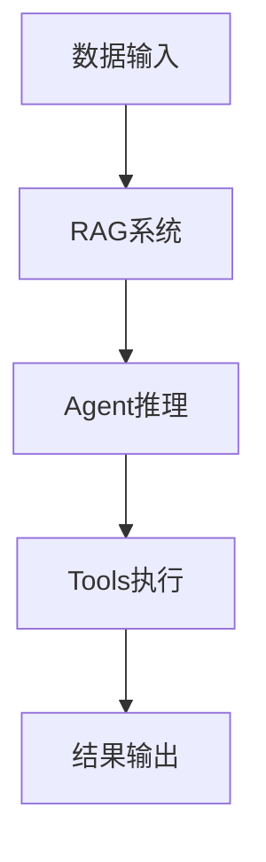

# 📘 第9章：AI Agent实战项目（电商 / CRM / 教师）

---

# 🎯 本章目标

学完本章你将能够：

- 理解真实AI Agent如何落地
- 设计一个完整AI系统
- 构建电商/CRM/教育Agent
- 理解企业级AI架构
- 将前面所有知识串起来

---

# 🧠 1. 为什么要做实战？

前面你学的是：

- Transformer（理解模型）
- RAG（知识增强）
- Agent（行动能力）
- Tool（工具调用）
- MCP（工具协议）

---

👉 但这些都是“单点能力”

---

## ✔ 这一章做什么？

> 把所有能力组合成真实系统

---

# 🏗 2. 电商AI Agent（完整案例）

---

## 📌 功能

电商AI Agent可以：

- 分析店铺数据
- 生成运营报告
- 推荐优化策略
- 自动写PPT
- 自动生成总结

---

## 📊 架构



---

## 🧠 流程

```text
用户上传店铺数据
   ↓
数据解析（CSV / Excel）
   ↓
RAG检索行业经验
   ↓
Agent分析问题
   ↓
生成优化方案
   ↓
输出报告
```

---

# 🧠 3. CRM Agent（客户管理系统）

---

## 📌 功能

- 客户分析
- 销售建议
- 自动写邮件
- 跟进提醒

---

## 📊 架构



---

## 🧠 应用

- B端销售系统
- SaaS客户管理
- 自动营销系统

---

# 🧠 4. 教师AI Agent（教育场景）

---

## 📌 功能

- 批改作业
- 生成题目
- 学生分析
- 学习建议

---

## 📊 架构



---

# 🧠 5. 三大系统统一架构

---

## 📌 本质一样

```text
数据 → RAG → Agent → Tool → 输出
```

---

## 📊 总架构



---

# 🧠 6. 企业级AI系统特点

---

## ✔ 1. 多数据源

- Excel
- API
- 数据库
- 文档

---

## ✔ 2. 多Agent协作

- Planner
- Analyst
- Writer
- Reviewer

---

## ✔ 3. 工具系统

- MCP
- Function Calling
- API系统

---

# 🧠 7. 一个完整AI系统

```text
用户输入
   ↓
数据层（RAG）
   ↓
推理层（Agent）
   ↓
工具层（Tools）
   ↓
输出层（Report / PPT / API）
```

---

# 🧠 8. 为什么这个很重要？

因为：

> 所有AI产品 = 这些模块组合

---

# 🧠 9. 面试必问

---

## ❓ 如何设计一个AI Agent系统？

答：

- RAG + Agent + Tools + Workflow

---

## ❓ 电商AI系统怎么做？

- 数据分析
- RAG行业知识
- Agent生成策略
- Tools生成报告

---

## ❓ CRM AI怎么做？

- 客户数据分析
- 分层
- 自动营销

---

# 📌 本章总结

- AI系统 = 多模块组合
- RAG + Agent + Tools = 核心架构
- 企业AI = 流程化系统
